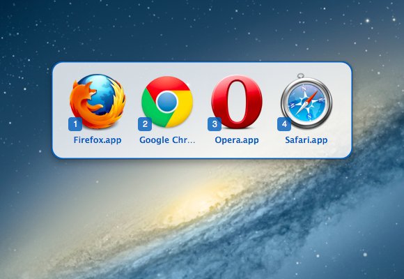

LinkRelay
========================================

LinkRelay is a utility that lets you switch your
default browser easily. You might find it useful if you're a web
designer or use multiple browsers in your workflow.

Install
----------------------------------------

The app works with Mac OS X 26 (Tahoe) onwards.

Download the latest release from the [Releases page](https://github.com/tmfone/LinkRelay/releases).

Features
----------------------------------------

 - A status-bar icon for quick access
 - An optional global hotkey triggers an overlay window for even quicker
   switching
 - Pressing Option (⌥) in the status menu lets you hide browsers that
   are incorrectly detected

Building & Running
----------------------------------------

LinkRelay requires [CocoaPods](https://cocoapods.org/) in order to be built.

After cloning this repository, run:

    $ pod install

in order to grab dependencies. Also, make sure that you open
`LinkRelay.xcworkspace`, not `LinkRelay.xcodeproj`.

Copyright & About
----------------------------------------

Copyright 2026, [tmf.one](https://tmf.one/). LinkRelay is available under the MIT
License.

Credits
----------------------------------------

  - [nth loop (MIT Licensed, LinkRelay is a fork of their Objektiv project)](https://github.com/nthloop/Objektiv)
  - [ZeroKit]by eczarny (MIT Licensed, portions of source used)
  - [MASShortcut] by Vadim Shpakovski (BSD Licensed)
  - [CDEvents] by Aron Cedercrantz (MIT Licensed)
  - [NSWorkspace+Utils] from Mozilla's Camino project (MPL)